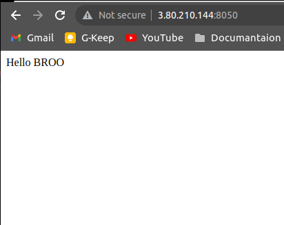

# Ansible 
# lab of day 1
create the inventory file to config the machines like the file in the repo
create playbook file to :
    install apache in two machines
    change the port from 80 to 8090
    custom page 
then run the ansible:
```bash
ansible-playbook playbook.yml -i inventory.txt
```



