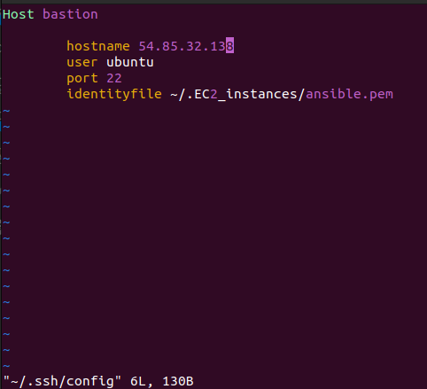
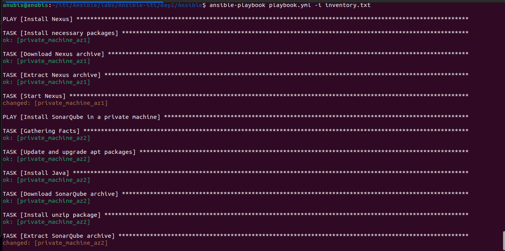
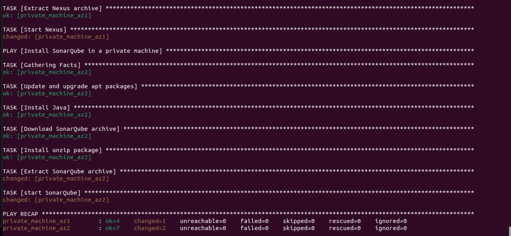

# ssh to private machine
change the ssh config file
```bash
 vi /.ssh/config
```
```text
Host bastion
    hostname public ip of bastion
    user ubuntu
    port 22
    identityfile path/to/file.pem
```


create the inventory file like the file in the repo
set the playbook to install the nexus in one machine and the other install  SonarQube 
then run the ansible:
```bash
 ansible-playbook playbook.yml -i inventory.txt
```





