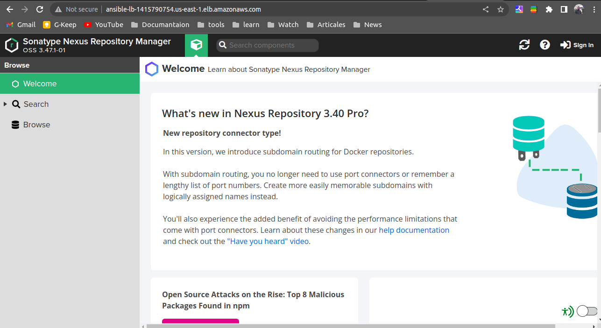
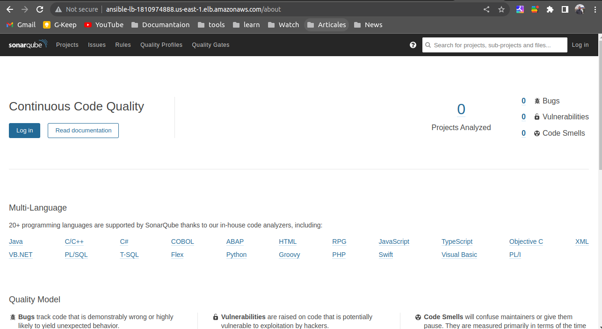

# ssh to private machine
change the ssh config file
```bash
 vi /.ssh/config
```
```text
Host bastion
    hostname public ip of bastion
    user ubuntu
    port 22
    identityfile path/to/file.pem
```


### Create the inventory file like the file in the repo

### initiate nexus role:
```bash
ansible-galaxy init roles/nexus
```

### initiate SonarQube role:
```bash
ansible-galaxy init roles/SonarQube
```
### run ansible command to start the main playbook:
```bash
 ansible-playbook playbook.yml -i inventory.txt
```





